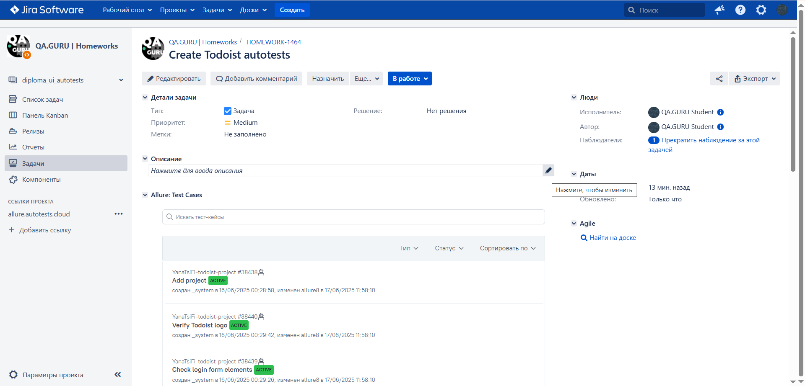
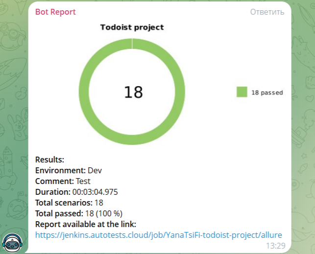
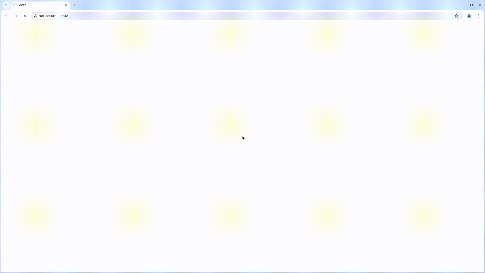
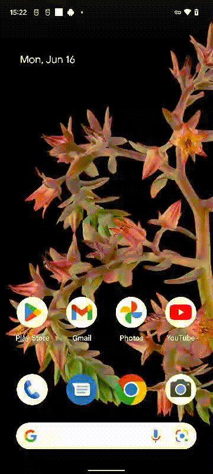

# Проект автоматизации тестирования Todoist

  

## 📋 Содержание

- [Описание](#описание)
- [Технологии и инструменты](#технологии-и-инструменты)
- [Реализованные проверки](#реализованные-проверки)
  - [Web](#web)
  - [API](#api)
  - [Mobile](#mobile)
  - [Ручные проверки](#ручные-проверки-управляются-в-allure-testops)
- [Запуск тестов](#запуск-тестов)
  - [Локальный запуск](#локальный-запуск)
  - [Удалённый запуск](#удалённый-запуск)
  - [Запуск в Jenkins](#запуск-в-jenkins)
- [Генерация отчетов](#генерация-отчетов)
- [Allure Report](#allure-report)
  - [Основная страница Allure Report](#1-основная-страница-allure-report)
  - [Просмотр тест-кейсов](#2-просмотр-тест-кейсов-в-allure-report)
  - [Графики и диаграммы](#3-графики-и-диаграммы-с-результатами-тестов)
- [Allure TestOps](#allure-testops)
  - [Основная страница Allure TestOps](#1-основная-страница-allure-testops)
  - [Авто и Ручные тест-кейсы](#2-авто-и-ручные-тест-кейсы)
- [Интеграция с Jira](#интеграция-с-jira)
- [Telegram-уведомления](#telegram-уведомления)
- [Видео из Selenoid](#видео-из-selenoid)
- [Видео из BrowserStack](#видео-из-browserstack)

## Описание

Todoist — один из самых популярных сервисов для управления задачами и повышения продуктивности, доступный как в веб-версии, так и на мобильных платформах.

Проект включает в себя автоматизированные UI-тесты для веб-интерфейса Todoist, с реализацией на Java, использованием Selenide, JUnit и Allure Report.

**Особенности проекта**:
- Использование шаблона проектирования `Page Object`
- Гибкая конфигурация через `Owner`
- Возможность запуска тестов:
  - локально
  - удалённо через Selenoid
  - в Jenkins по тегам
- Генерация данных с помощью `Faker`
- Моделирование данных в API-тестах с помощью `Lombok`
- Интеграция с:
  - Allure Report (пошаговые отчёты, скриншоты, видео)
  - Allure TestOps (управление кейсами и запуск из интерфейса)
  - Jira (привязка тестов к задачам)
  - Telegram (уведомления о прохождении тестов)
- Уведомления о статусе тестов приходят автоматически в Telegram-чат
- По завершению каждого запуска формируется Allure-отчёт со следующими данными:
  - Подробные шаги выполнения
  - Скриншот финального состояния страницы
  - Исходный код DOM
  - Консоль браузера
  - Видео выполнения теста (Selenoid и BrowserStack)

## Технологии и инструменты

  
  
  
  
  
  
  
  
  
  
  
  
  
  
  

## Реализованные проверки

### Web
- [x] Успешная авторизация с валидными данными
- [x] Ошибка при вводе неправильного пароля
- [x] Отображение кнопки входа на форме логина
- [x] Проверка элементов формы регистрации
- [x] Ввод текста в поле email
- [x] Ввод текста в поле пароля
- [x] Успешная регистрация нового пользователя
- [x] Проверка кнопки "Start for free"

### Api
- [x] Получение списка всех проектов
- [x] Получение конкретного проекта по ID
- [x] Создание нового проекта
- [x] Обновление названия проекта
- [x] Удаление проекта
- [x] Негативный сценарий — создание проекта без названия
- [x] Создание задачи в проекте

### Mobile
- [x] Проверка элементов формы входа
- [x] Отображение логотипа Todoist
- [x] Проверка текста на втором экране онбординга

### Ручные проверки (управляются в Allure TestOps)
- [x] Добавление новой команды в профиле
- [x] Поиск по профилю
- [x] Работа с боковой панелью

## Запуск тестов

> **Примечание:**  
> Убедитесь, что у вас установлены Java, Gradle, IntelliJ IDEA (рекомендуется), Appium Server (для мобильных тестов), Docker (для Selenoid) 
> Конфигурационные файлы `.properties` лежат в папке `resources` — при необходимости их можно изменить.

### Локальный запуск

Основные команды:
#### Все тесты
gradle clean allTests -DbaseUrl=<your_base_url>

#### Только WEB
gradle clean webTests \
-Dbrowser=<chrome|firefox> \
-DbrowserVersion=<версия> \
-DbrowserSize=<разрешение> \
-DbaseUrl=<your_base_url>

#### Только API
gradle clean apiTests -DbaseUrl=<your_base_url>

#### Мобильные тесты (локальный эмулятор)
gradle clean mobileTests -DdeviceHost=local_emulator -DbaseUrl=<your_base_url>

### Удалённый запуск

#### Selenoid (Web)
gradle clean webTests \
-DremoteUrl=selenoid.autotests.cloud \
-Dbrowser=<chrome|firefox> \
-DbrowserVersion=<версия> \
-DbrowserSize=<разрешение> \
-DbaseUrl=<your_base_url>

#### BrowserStack (Mobile)
gradle clean mobileTests -DdeviceHost=browserstack -DbaseUrl=<your_base_url>

### Запуск в Jenkins
Основные параметры для запуска:

- `TEST_TYPE` - тип тестов (WEB/API/MOBILE/ALL)
- `browser` - браузер (chrome/firefox). По умолчанию: `chrome`
- `browserVersion` - версия браузера. По умолчанию: `127.0` для Chrome, `124.0` для Firefox
- `browserSize` - размер окна браузера. По умолчанию: `1920x1080`
- `remoteUrl` - адрес удаленного сервера. По умолчанию: `selenoid.autotests.cloud`
- `mobileDeviceSource` - для мобильных тестов (browserstack/local_emulator)
- `ENVIRONMENT` - окружение (stage.qa.guru/test.qa.guru)
- `BASE_URL` - адрес тестируемого приложения.

## Генерация отчетов

### Сформировать Allure отчет
gradle allureReport

### Открыть отчет локально
gradle allureServe

### Отчеты в Jenkins доступны автоматически после выполнения сборки.

## Allure-report
После завершения сборки в блоке **Build History** напротив номера сборки появятся значки **Allure Report** и **Allure TestOps**.  
При клике на них откроются страницы с генерированным HTML-отчетом и тестовой документацией.

### Скриншоты:

#### 1. Основная страница Allure Report

#### 2. Просмотр тест-кейсов в Allure Report

#### 3. Графики и диаграммы с результатами тестов

## Allure-testops
На Dashboard в Allure TestOps удобно отслеживать статистику по тестам: сколько добавлено, какие ручные, а какие автоматизированы.
Платформа позволяет легко запускать нужные тесты, анализировать результаты и управлять тестированием в одном месте — это значительно упрощает работу команды и повышает её эффективность.

#### 1. Основная страница Allure Testops

#### 2. Авто и Ручные тест-кейсы

## Интеграция-с-jira
Реализована интеграция Allure TestOps с Jira.  
В каждом тикете отображаются:

🔹 связанные тест-кейсы, написанные в рамках задачи;  
🔹 результаты их прогона (успешные, упавшие и пропущенные);  
🔹 отчётность прямо внутри Jira — удобно для QA и разработчиков.

### Пример интеграции

## Telegram-уведомления
После завершения сборки бот в Telegram автоматически обрабатывает результаты и отправляет уведомление с отчетом о прогоне тестов.

### Содержание уведомления

- ✔️ Окружение, в котором запускались тесты
- ✔️ Комментарий к прогону 
- ✔️ Длительность прохождения тестов
- ✔️ Общее количество сценариев
- ✔️ Процент прохождения тестов
- ✔️ Ссылка на Allure отчет

### Пример уведомления

## Видео-из-selenoid
Каждый автотест записывается на видео с помощью Selenoid. Это позволяет быстро находить и анализировать ошибки при выполнении тестов. Видео автоматически прикрепляется к отчёту в Allure.

### Пример записи выполнения теста:

## Видео-из-browserstack
Для мобильных автотестов используется облачная платформа BrowserStack, которая также записывает видео каждого прогона. Это помогает отслеживать поведение приложения на разных устройствах и ОС.

### Пример записи выполнения мобильного теста:

